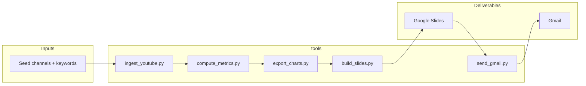

# Plan: YouTube AI / automation niche intelligence → Slides → Gmail

## Objective

Build a repeatable automation that:

1. Ingests **public** YouTube data for a defined niche (AI and AI automation): seed channels, recent uploads, and metadata/stats.
2. Derives **insights** (what is publishing, what is gaining traction, patterns in titles/topics, optional comment samples).
3. Produces a **professional Google Slides** deck with charts and images.
4. Delivers it via **Gmail** (link to Slides, optional PDF attachment).

**Principle:** Deterministic steps live in `tools/`; orchestration and interpretation follow a workflow in `workflows/`. Intermediates in `.tmp/`; **deliverables** in Google cloud (Slides + email), per [CLAUDE.md](../CLAUDE.md).

---

## Constraints (non-negotiable)

| Constraint | Implication |
|------------|-------------|
| YouTube Data API v3 quota | Minimize `search.list` (100 units/call). Prefer `channels.list` → uploads playlist → `playlistItems.list` + `videos.list` (1 unit/call typical). |
| No “full scrape” of the web UI | Official API + optional RSS hints; avoid fragile scraping as the core. |
| Transcripts | Not assumed in v1; add later if you invest in caption pipelines. |
| Correctness before commit | Verify runs and outputs before merging; commit only known-good states. |

---

## Architecture (WAT)

- **Workflow (later):** `workflows/youtube_niche_report.md` — inputs, order of CLI calls, env vars, failure handling, when to request quota increase.
- **Snapshot store:** Persist time-stamped snapshots (CSV/JSON in `.tmp/` during dev; **Sheets or Drive** for durable history if you need week-over-week velocity).

---

## Phase 0 — Prerequisites

- [ ] Google Cloud project: enable **YouTube Data API v3**, **Google Slides API**, **Gmail API** (send as user or domain-wide per your setup).
- [ ] OAuth desktop or installed app: `credentials.json` → `token.json` (gitignored); `.env` for API keys if any third-party added later.
- [ ] Python 3.11+ venv; extend [requirements.txt](../requirements.txt) with `google-api-python-client`, `google-auth-*`, `pandas`, optional `matplotlib` or `plotly` for charts.

**Verification:** One script that lists a single channel’s uploads (read-only) without quota burn on search.

---

## Phase 1 — Ingestion

**Goal:** Given seed channel IDs (and optional sparing `search.list` for discovery), pull recent videos and stable metadata.

- Resolve **uploads playlist id** per channel (`channels.list` with `contentDetails`).
- Paginate **`playlistItems.list`**, then batch **`videos.list`** for `videoId`s.
- Store raw rows: `video_id`, `channel_id`, `published_at`, `title`, `description`, `view_count`, `like_count`, `comment_count`, `duration`, etc.

**Outputs:** `.tmp/ingest_YYYYMMDD.jsonl` or Parquet; later mirror summary to **Sheets** for “source of truth” if desired.

**Verification:** Row counts match API pagination; spot-check 3 videos in the YouTube UI.

---

## Phase 2 — Metrics and “what’s working”

**Goal:** Turn snapshots into comparable metrics (v1 = simple; v2 = velocity).

- v1: Top N by views / engagement ratio (likes+comments per 1k views) in last window (e.g. 14 days).
- v2: **Velocity** requires two snapshots; schedule weekly runs and diff views.
- Optional: title keyword frequency (simple tokenization), Shorts vs long split (`duration`).

**Outputs:** `.tmp/metrics_YYYYMMDD.csv` + summary dict for the deck narrative.

**Verification:** Recompute metrics manually for one channel; numbers match.

---

## Phase 3 — Charts and graphics

**Goal:** PNGs suitable for Slides (bar, line if time series, simple tables as images if needed).

- Generate charts to `.tmp/charts/` with consistent fonts/colors (brandable later).
- No chart goes into Slides without being generated by script (reproducible).

**Verification:** Open PNGs locally; axes and titles match the CSV.

---

## Phase 4 — Google Slides deck

**Goal:** Programmatically create/update a presentation: title slide, executive summary, one section per insight, chart slides, appendix with methodology and quota note.

- Use **Slides API**: create presentation, insert images (upload to Drive first, or use public URLs from Drive), set text.
- Share **edit or view** link per your preference.

**Verification:** Deck opens in browser; all images render; no placeholder text left.

---

## Phase 5 — Gmail delivery

**Goal:** Email you (and optional CC) with subject line, short summary, **link to Slides**, optional **PDF export** attachment if you add export step.

- Gmail API: `users.messages.send` with HTML body and attachment.
- Store recipient(s) in `.env` (e.g. `REPORT_TO_EMAIL=`).

**Verification:** Send test email to yourself; link works; spam check once.

---

## Phase 6 — Scheduling and operations

- **Windows Task Scheduler** or cron (WSL): weekly full run + optional daily light ingest for seed channels only.
- Log each run: date, quota used (estimate), row counts, failures.
- Document in workflow: rate limits, backoff, what to do when quota exceeded.

---

## Risks and mitigations

| Risk | Mitigation |
|------|------------|
| Quota exhaustion | Playlist-first strategy; cache channel IDs; batch `videos.list`; apply for quota increase if needed. |
| Misleading “trending” | Label as “strong traction in our sample,” not platform-wide truth. |
| API changes | Pin client library versions; small surface area in tools. |

---

## Implementation order (suggested)

1. Ingest + write `.tmp/` (Phase 1).
2. Metrics CSV (Phase 2).
3. Charts (Phase 3).
4. Slides (Phase 4).
5. Gmail (Phase 5).
6. Workflow markdown + scheduling notes (Phase 6).

---

## Out of scope (initially)

- Full comment threads at scale (quota-heavy); sample later.
- Automated transcript NLP.
- Non-YouTube sources (TikTok, etc.) unless you add a separate plan.

---

## Next step

Add `workflows/youtube_niche_report.md` with exact CLI invocations and env vars once Phase 1 tool exists, then implement tools in order above—**commit only after each phase is verified**.
